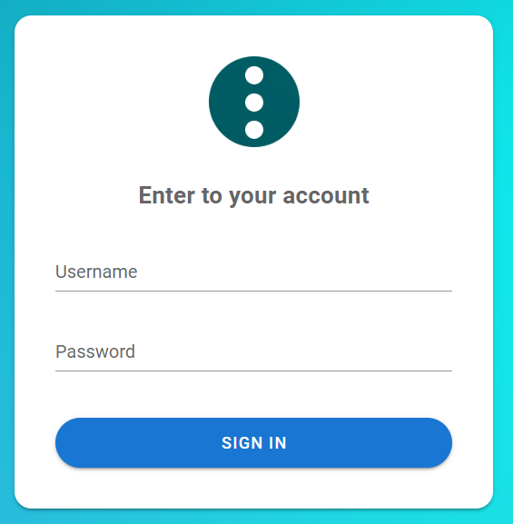

# Semaphore Setup Guide

## 1. Start Semaphore with Docker Compose
Copy the provided `docker-compose.yml` file into your desired directory.

    docker-compose up -d

This will start Semaphore in the background.

---

## 2. Access the Web UI
Open your browser and go to:

    http://localhost:3000

Login with the default **admin** credentials shown in the container logs.

---

## 3. Initial Configuration
1. **Create a Project**  
   A project groups your playbooks, inventory, and tasks.

2. **Set Up Your Account**  
   Configure your profile details and password.

3. **Configure a Git Repository**  
   Connect Semaphore to your Ansible playbook repository (e.g., GitHub or local Git server).

4. **Add a Key Store**  
   Store SSH keys or credentials. For local testing, add your SSH key here.

5. **Set Up Inventory**  
   Define your target hosts using a static inventory (YAML/INI) or dynamic source.

6. **Create a Task**  
   - Choose **Ansible Playbook** as the task type.  
   - Select your repo, playbook, and inventory.

---

## 4. Deploy!
Click **Play ▶** on your task.  

Semaphore will run your Ansible playbook against the inventory.  
If all goes well, you’ll see fireworks 🎆 in the UI when it completes successfully.

---

## ✅ Summary
1. `docker-compose up -d`  
2. Login at [http://localhost:3000](http://localhost:3000)  
3. Create project → configure account → add repo → add keys → set up inventory → create task  
4. Hit play and enjoy 🎉
