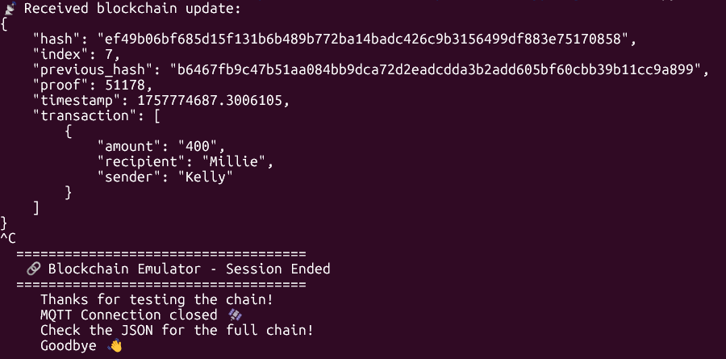
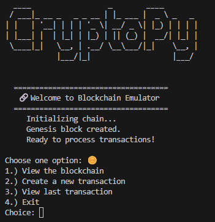
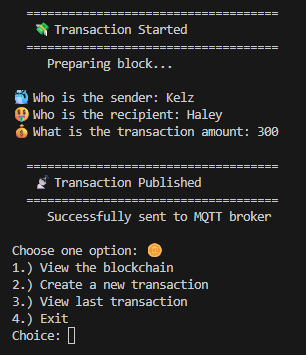
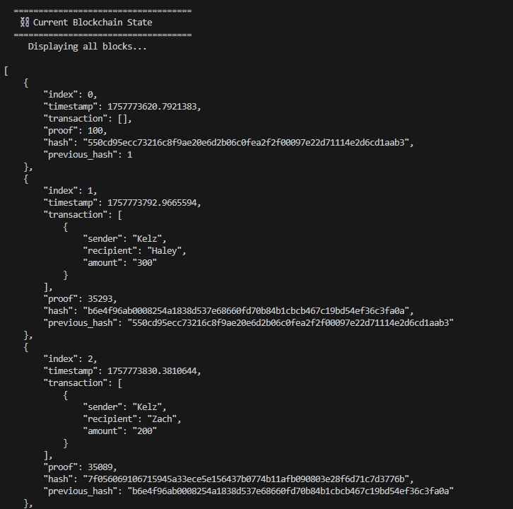
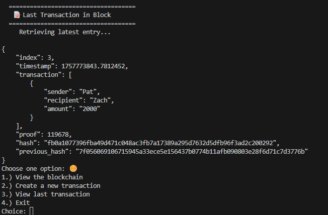

# 🐍⛓️ PyChain – Blockchain Emulator with MQTT 📡
## Overview

PyChain is a lightweight blockchain emulator written in Python. It demonstrates:

- Blockchain fundamentals: blocks, transactions, proof-of-work.

- Real-time updates: publishing blockchain data over MQTT.

- User-friendly CLI: interact with the blockchain directly from your terminal.

## 🔧 Components

### MQTT Broker

Runs inside a container using the official Eclipse Mosquitto image.

Publishes blockchain updates to the topic blockchain/data.

Example run command:

`docker run --name blockchain_broker -p 1883:1883 eclipse-mosquitto:2`

### Publisher

After each new block/transaction, the blockchain state is published to the broker.

### Subscriber

A Python script using paho-mqtt.

Connects to the broker, subscribes to blockchain/data, and pretty-prints JSON updates.

## CLI Application

Menu-driven interface to:

- View the full blockchain

- Create new transactions

- View the last transaction

- Exit gracefully and write Blockchain to JSON

## 📸 Screenshots
### Main Menu

### Create Transaction

### View Entire Chain

### View Last Transaction

## 🚀 How It Works

Start the MQTT broker container.

Run the CLI blockchain emulator.

Each transaction/block is:

Added to the local blockchain.

Published to MQTT for others to subscribe.

Run the subscriber script (or mosquitto_sub) to see blockchain updates in real time.

## 📦 Requirements

- Python 3.10+

- paho-mqtt

- Docker (for broker)

- Install dependencies:

`pip install paho-mqtt`