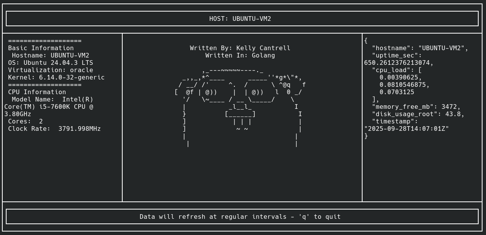
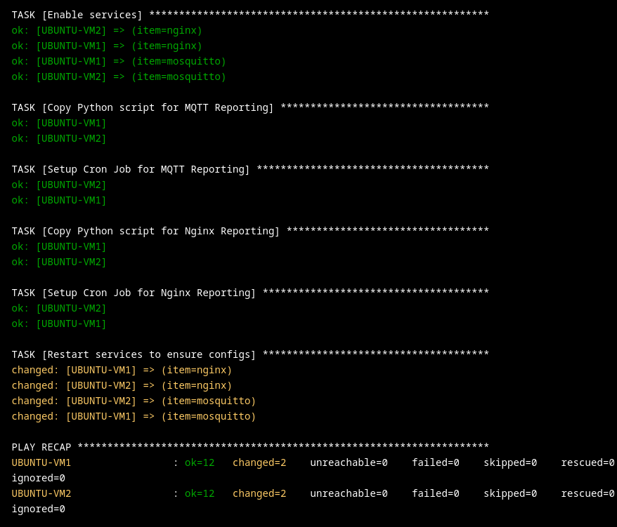
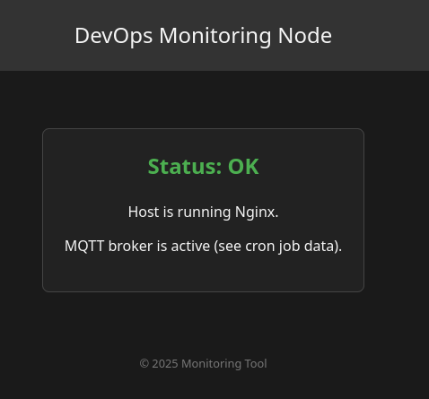
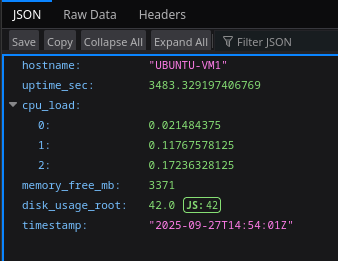
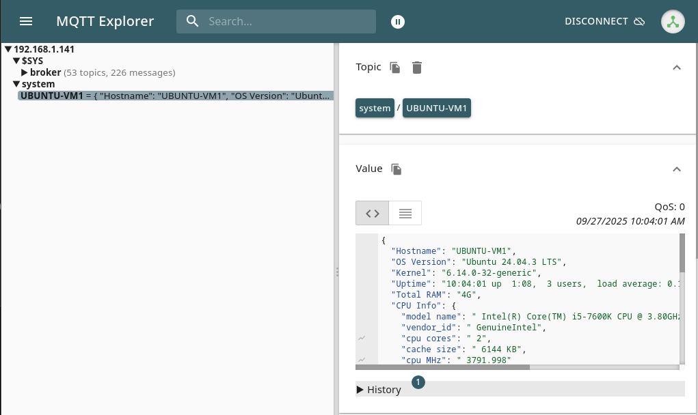
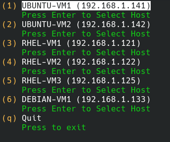

# 🦫📡 GoHelper – DevOps Monitoring with MQTT + Nginx 🌐
## Overview

GoHelper is a lightweight DevOps monitoring tool written in Go. It demonstrates:

- Real-time telemetry: VM metrics published over MQTT.

- Web integration: system data served via Nginx as JSON.

- TUI dashboard: interactive monitoring with tview

The program allows the user to recieve useful information from machines on their network. For my own use case, I run this program to monitor virtual machines in my home lab.

Example:

## 🔧 Components
**Virtual Machines**

Each VM runs:

- MQTT Broker (Eclipse Mosquitto)

- Nginx Server (serving status.json with system info)

- Python Publisher (cron job collects system stats → publishes to MQTT and updates JSON file)

**MQTT Subscriber (Go)**

- Subscribes to VM topics (system/+).

- Unmarshals JSON payloads into structured Go types.

- Displays metrics in a clean terminal UI with tview.

**Web Fetcher (Go)**

- Uses Go’s net/http to GET the status.json file from each VM.

- Integrates web data alongside MQTT metrics in the TUI dashboard.

## 📊 TUI Dashboard

Built with tview + tcell, the interface provides:

- Basic Information: hostname, OS, kernel, uptime.

- CPU Info: model, cores, MHz.

- Other: disk usage, free memory, etc.

## 🚀 How It Works

1. Deploy VMs with Ansible + Semaphore.

Note: Services will now be active and can be verified by connecting to the host over port 80:

2. Python script (via cron) generates /var/www/html/status.json and publishes it to the Nginx service.

3. Nginx serves the JSON file at http://<vm-ip>/status.json.

4. Python script generates a JSON to server over MQTT

5. Cron job publishes the data to self-hosted broker

6. User selects the host they want to connect to

6. GoHelper subscribes to MQTT topics + fetches HTTP JSON.

7. Data is displayed in a dynamic grid-based TUI dashboard.

## 📦 Requirements

- Go 1.22+

- tview + tcell

- paho.mqtt.golang (MQTT client)

- YAML v3 (for host config parsing)

