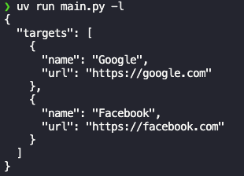
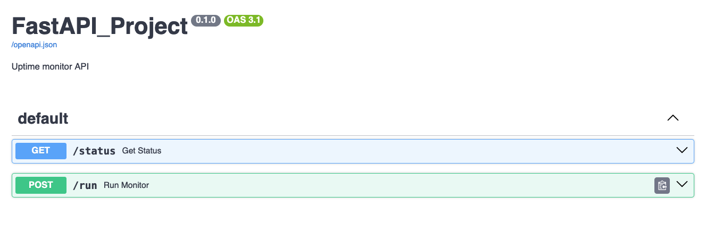
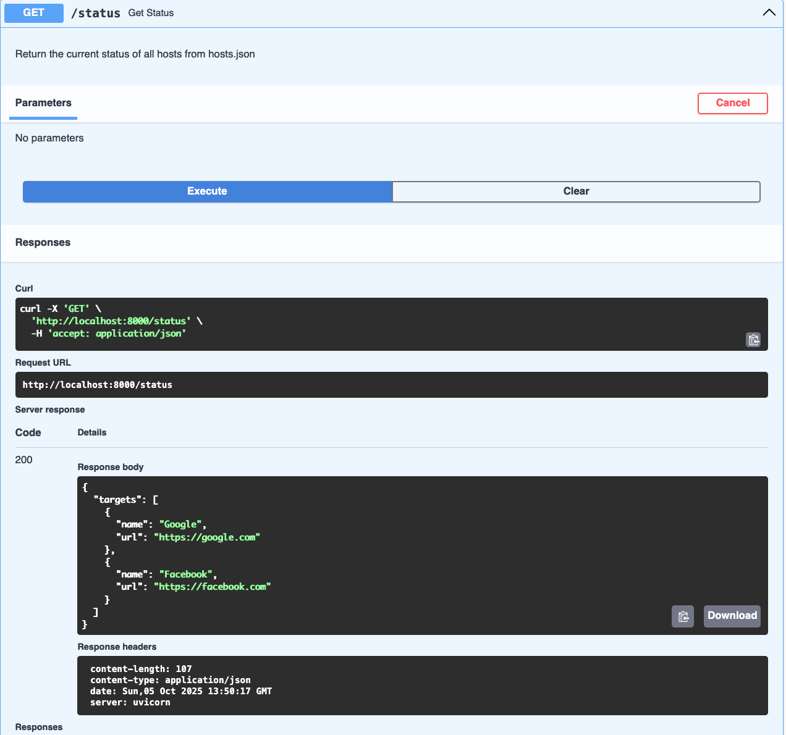

⚡ PyPulse — Asynchronous Network Health Monitor

A Python-based tool for monitoring network endpoint availability — built to deepen understanding of APIs, async I/O, and logging.

## 🚀 Overview

FastPulse is a hybrid CLI + API application designed to check network health and uptime across multiple endpoints concurrently.
It serves both as a learning project and a practical monitoring tool.

Key learning areas:

- Asynchronous programming with asyncio + aiohttp

- Logging with Python’s logging module

- RESTful API development with FastAPI

- File I/O and JSON configuration management

## 🗂️ Project Structure

File Description
main.py -> Core entry point and CLI logic
api_server.py -> FastAPI web interface
async_monitor.py -> Asynchronous request engine
file_functions.py -> Read/write and modify host config
resources.py -> Misc. shared constants and data
actions.log -> Log file for all application events
hosts.json -> JSON configuration file for endpoints

## 🖥️ CLI Usage

Run from project root:
`python main.py [options]`

Options

```
  -h, --help            show this help message and exit
  -v, --verbose         generate verbose output
  -c CONFIG, --config CONFIG
                        path to config file
  -t, --test            run tests against single endpoints
  -r, --run             run tests against all endpoints
  -a, --add             add endpoint to host file
  -x, --remove          remove endpoint from host file
  -l, --list            list endpoints from host file
  -i, --init            generate a default config file
```

Examples

```
python main.py -l      # List current endpoints
python main.py -a      # Add a new endpoint
python main.py -r      # Run async checks on all endpoints
```



## 🌐 API Usage

Start the API server:
`uvicorn api_server:app --reload`

Then visit:

- Docs (Swagger UI): http://127.0.0.1:8000/docs



- Endpoints:
  - GET /status → View configured hosts
  - 


- POST /run → Run async monitor and return results


## 🧩 Example Flow

Initialize default config:
`python main.py -i`

Add endpoints:
`python main.py -a`

Run Async checks:
`python main.py -r`

Start API server for dashboard or remote access:
`uvicorn api_server:app --reload`

## 📘 Notes

- Logs are written to actions.log in the project root.
- Hosts are stored in hosts.json.
- Both CLI and API share the same configuration and logging system.
