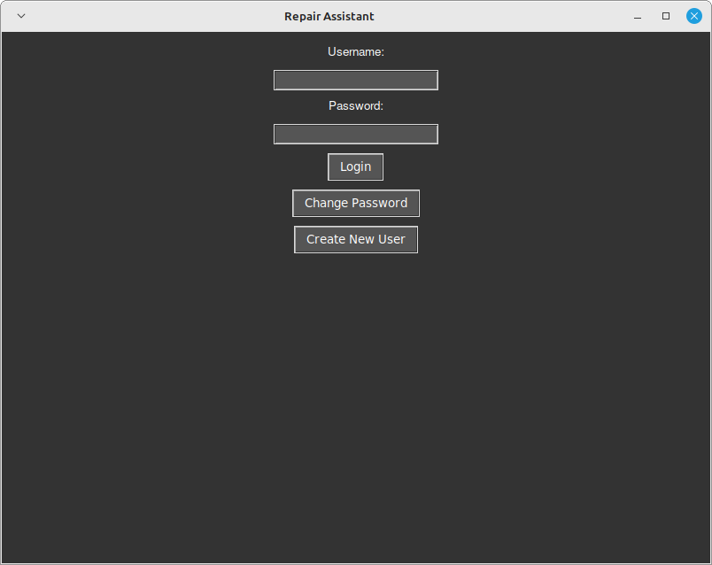
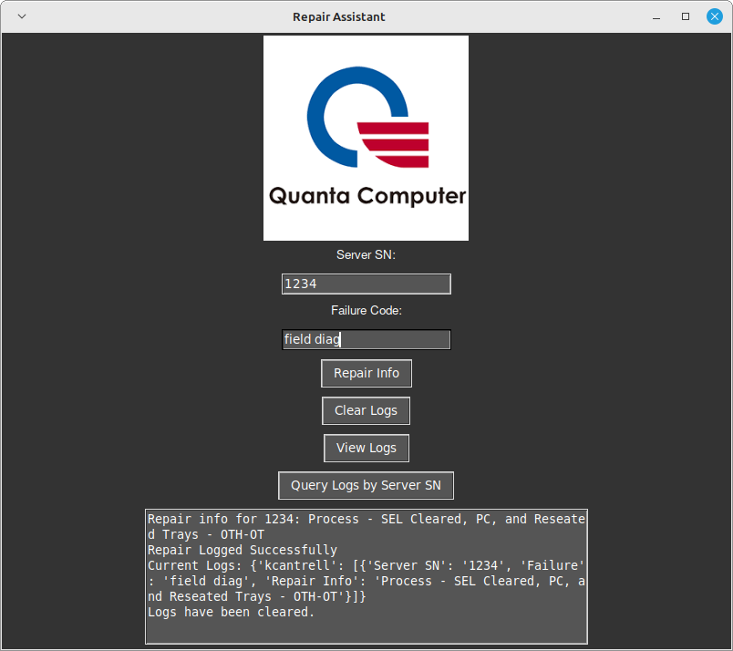

### Repair Logging Assistant for Quanta Nashville

**Objective:** Develop a Python-based tool to aid new technicians in creating systematic and informative repair logs, simplifying the technical documentation process.

**Tools & Methods:**

- **Python Development:** Utilized Python's rich ecosystem to build the application, with an emphasis on readability and functionality.
- **User Experience Design:** Crafted a user-friendly interface to accommodate technicians with varying levels of expertise.
- **OOP Design:** Employed Object-Oriented Programming principles to ensure the system's scalability and maintainability.
- **Logging Mechanism:** Implemented a robust logging feature for a comprehensive repair history documentation.
- **Search Capabilities:** Integrated query functionality for efficient retrieval of logs using server serial numbers.

**Outcomes & Benefits:**

- Delivered an effective solution to streamline the repair logging process, significantly aiding new technicians.
- The assistant's design enhances the accessibility of technical documentation, ensuring that repair notes are both systematic and informative.
- The OOP foundation of the project ensures that it can be easily expanded and adapted to future needs and additional functionalities.
